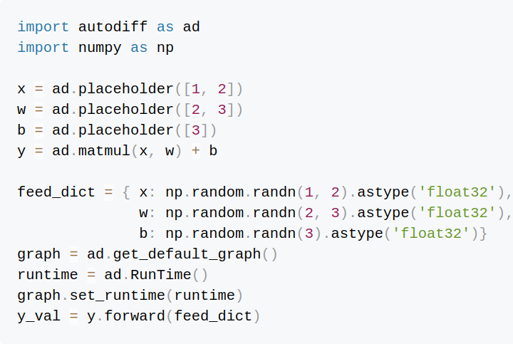
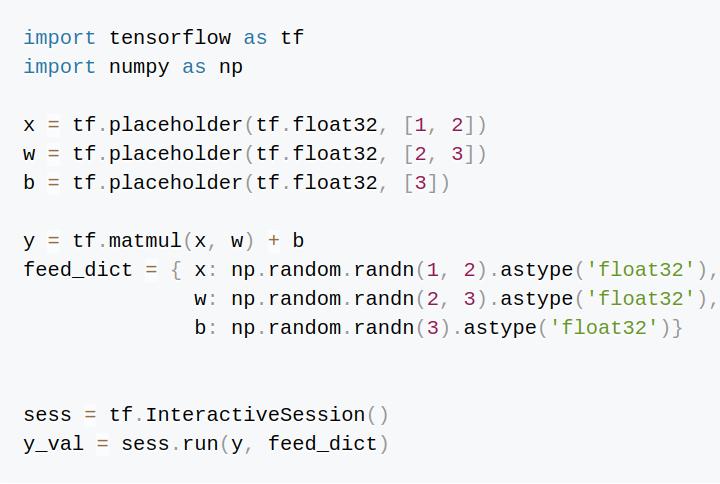

# Training Deep Neural Network using only NumPy


<p align="center">
   
  <br>
  <br>
  Left: autodiff; Right: tensorflow  

</p>


[Automatic differentiation](http://colah.github.io/posts/2015-08-Backprop/) refers to a set of algorithmic techniques for numerically computing the derivative of a function. The function is usually represented as a computational graph formed by a collection of nodes. Each node corresponds to an intermediate variable whose value "flows" to the final outcome. A node holds two pieces of data -- the variable's value and its derivative. To compute the derivatives, the intermediate values are first evaluated in the direction of "data flowing", a process called **forward pass**, providing results needed for the **backward pass** where the derivatives are computed in the opposite direction of data flowing.


This is a NumPy based framework that provides Python program interfaces for defining the computational graph and mechnisms for running the forward and backward pass to compute the derivatives. The computational graph can be built by connecting nodes (like you would do in TensorFlow or PyTorch) using basic arithmetic operations, tensor transformation operations, and common neural network layers. The actual computation of the intermediate values and derivatives is handled by NumPy. 

## Highlights
* Forward pass and Backward pass are expressed as vectorized (i.e. broadcasting) Numpy operations.
* Provides common neural network layers (Convolotion, BatchNorm, Dropout, etc.) that allows one to build a wide range of neural network architectures for different tasks (e.g. from logistic regression, to image classification, and images generation using GAN).


## Table of Contents

* [Installation](#Installation.md)
* [Usage](Usage.md)
* [Demos](#Extension)
* [Extension](#Extension)


## Installation
Note that the only third party library dependency is NumPy. And this framework is tested in Python3 (some Python2 syntaxes are not compatible).

After cloning the repository,

```
git clone git@github.com:chao-ji/np-auto-diff.git autodiff
```

you need to make sure that the parent directory `mydir`

```
mydir
├──── autodiff
```

is on the Python search path list by adding 
```
PYTHONPATH=$PYTHONPATH:/path_to_mydir/mydir
```

to file `.bashrc` or `.bash_profile` found in your home directory.

You should be able to run `import autodiff` in the Python interactive shell if installation was successful.

## Usage 

### Graph and Node
`Graph` is a container that contains a number of `Node` objects. 

There are two ways to define a computational graph. The first is to assume there is a *default* graph.
```python
import autodiff as ad

a = ad.placeholder((2, 3))
b = ad.placeholder((2, 3))
c = ad.add(a, b)

default_graph = ad.get_default_graph()

assert a.graph == default_graph
assert b.graph == default_graph
assert c.graph == default_graph
```

The second is to explicitly create a graph, and start a context in which nodes are defined.  
```python
graph = ad.Graph()

with graph.as_default_graph():
  a = ad.placeholder((2, 3))
  b = ad.placeholder((2, 3))
  c = ad.add(a, b)

default_graph = ad.get_default_graph()

assert a.graph == graph
assert a.graph != default_graph
```

### RunTime
`RunTime` is an environment which simulates the execution of a `Graph`. It stores the intermediate value and derivative of each node in a `Graph`. To run a `Graph` in a `RunTime`, you need to couple them by setting `graph.set_runtime(runtime)`, so that the `graph` object can access the properties of the `runtime` object.

```python
import autodiff as ad

a = ad.placeholder((2, 3))
b = ad.placeholder((2, 3))
c = ad.add(a, b)

runtime = ad.RunTime()
graph = ad.get_default_graph()
graph.set_runtime(runtime)

feed_dict = {a: [[0., 1., 2.], [3., 4., 5.]], b: [[1., 1., 1.], [0., 0., 0.]]}

c_val = c.forward(feed_dict)
c.backward(feed_dict, bwval=[[1., 1., 1.], [1., 1., 1.]])

print(c_val)
print(runtime.get_bwval(a.name))
print(runtime.get_bwval(b.name))
```
OUTPUT

```python
# c_val
[[1. 2. 3.]
 [3. 4. 5.]]
# a's backward val
[[1. 1. 1.]
 [1. 1. 1.]]
# b's backward val
[[1. 1. 1.]
 [1. 1. 1.]]

```

In the example above, `a` and `b` are `Placeholder` objects whose value must be supplied by a `feed_dict`, a Python `dict` that maps a `Node` to numeric value convertable to NumPy array.

`forward` starts off the **forward pass** -- `c.forward(feed_dict)` returns the value of `c`, and has the side effect of computing the intermediate values that flow to `c` (i.e. the values of `a` and `b`).

Similarly `backward` starts off the **backward pass**. However, `c.backward(feed_dict)` does not return a value, but only has the side effect of backpropagating gradient/derivative to all nodes whose value flow to `c`. You can pass an array holding the gradient/derivative to be backpropped as the second argument `bwval=`to `backward`, or you can optionally leave it out and it will default to an all-one array.

### Shape
```python
import autodiff as ad
import numpy as np

a = ad.placeholder((None, 1, 2, 3))
print(a.shape) # Shape(None, 1, 2, 3)
feed_dict = {a: np.random.normal(size=(1, 1, 2, 3))}
```
A `TensorShape` object stores the *static shape* of a node, and it represents the best knowledge we know about the shape of a node before actually running the `Graph` in a `RunTime`. For example, the *batch size* dimension is often unknown when building a `Graph`.


In the example above, the `Placeholder` object `a` takes the first argument as the shape, and its first entry is left as `None`, which means it is a wildcard that matches any non-negative integer.

Note the static shape must match a *dynamic shape* (i.e. the actual shape of an NumPy array embodied by a node).

### Arithmetic operations
```python
import autodiff as ad

a = ad.placeholder((2, 3))
b = a + [[1., 2., 3.], [4., 5., 6.]]
c = [3., 4., 5.] * a
```
You can define a `Graph` using arithmetic functions like `add()` or `multiply()`. Alternatively, you can simply use Python arithmetic operators `+` or `*`, which is shorthand for `add()` and `multiply()`.

Note the arithmetic operations allow for the NumPy style [broadcasting](https://docs.scipy.org/doc/numpy-1.15.0/user/basics.broadcasting.html), and the other non-`Node` argument is implicitly converted to a `Constant` type of `Node` and added to the graph.

## Demos

The above code snippets only cover the essential mechanics to create and execute a computational graph. For more in-depth usage, please follow these demos.

* [Spiral dataset](demos/spiral_dataset.ipynb)
* [Logistic Regression](demos/logistic_regression.ipynb)
* [Batch Normalization](demos/batch_norm.ipynb)
* [Conv Net for classifying images](demos/conv_net.ipynb)
* [GAN for generating images](demos/dcgan.ipynb)

## Extension

Currently only a minimal set of `Node` classes have been implemented (e.g. `Add`, `Multiply`, `Reshape`, `Conv2D`, `FusedBatchNorm`), and additional `Node` types will be added later. To add new `Node` types, you need to subclass from the `Node` class in this file [base_node.py](core/base_node.py), and override the abstract methods `_forward()` and `_backward()`. Check [this guide](g3doc/forward_backward.md) for more details. 

## Disclaimer

I started this work only as an experiment for understanding how deep neural networks are trained, so I never intend this to be used in a production setting.

