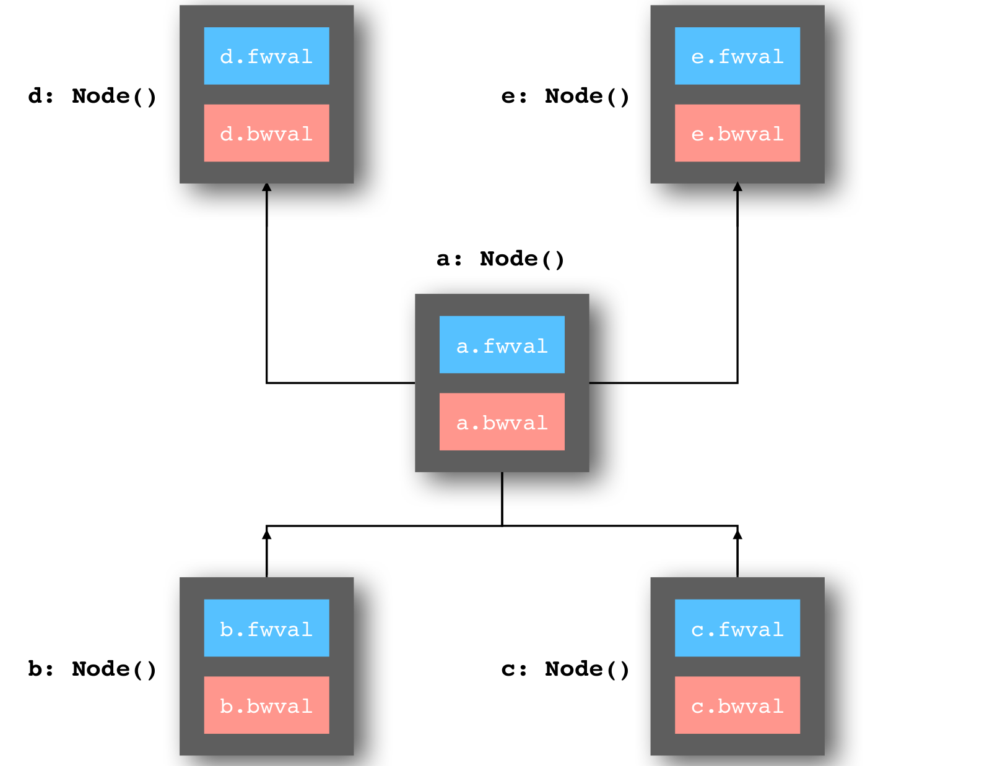
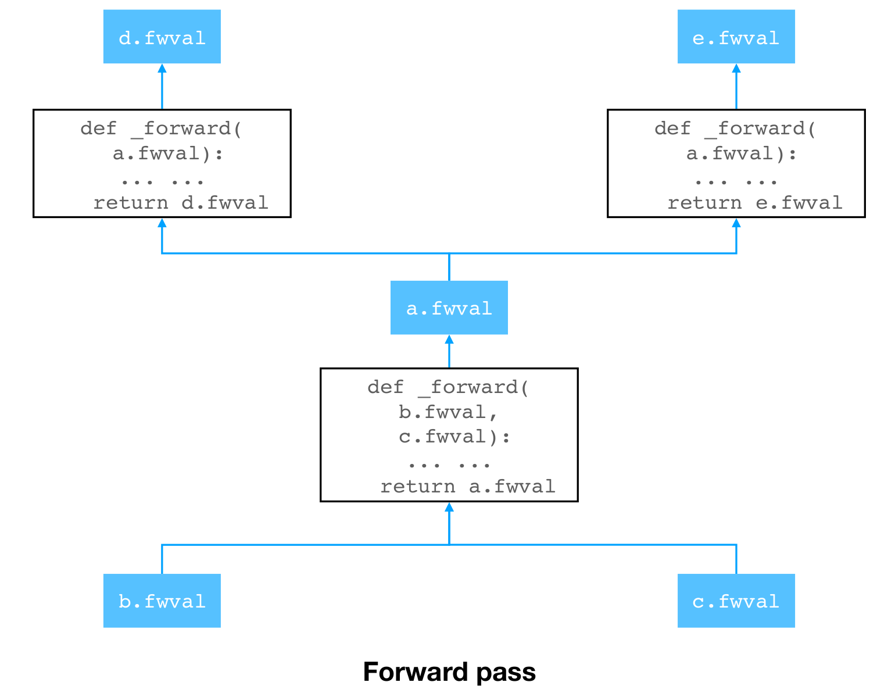
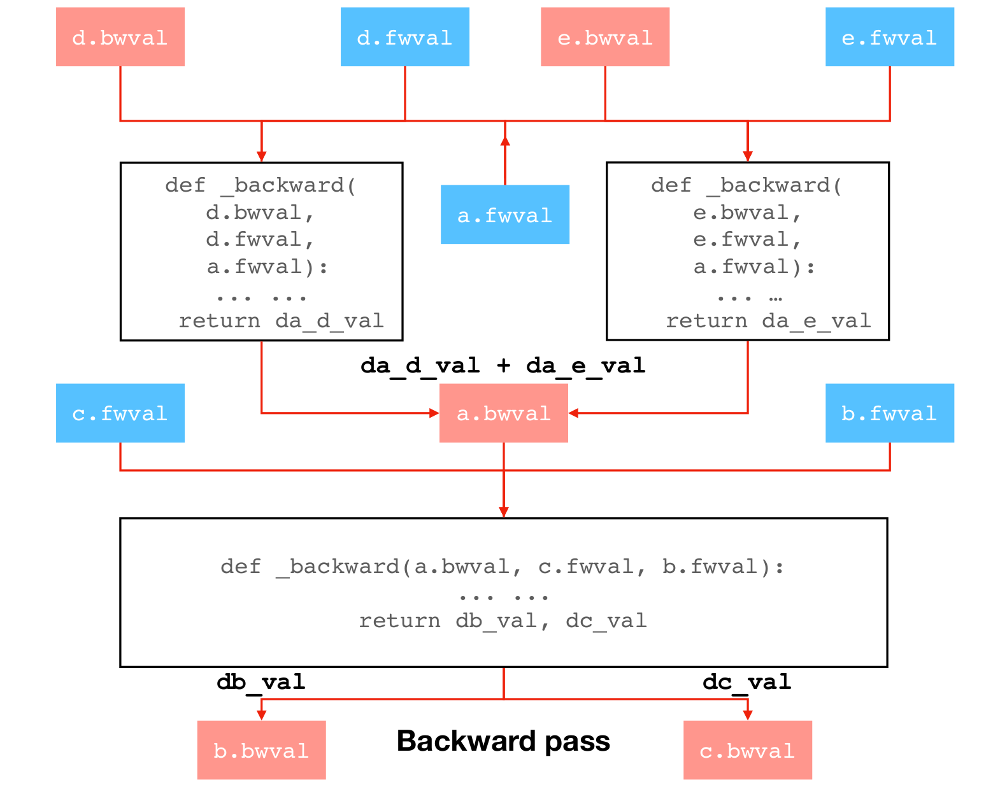

This guide explains the mechanics of `_forward` and `_backward`.

Suppose there is a graph formed by 5 nodes `a`, `b`, `c`, `d` and `e`,

where 
```python
b = ad.placeholder((2, 3))
c = ad.placeholder((3, 5))
a = ad.matmul(b, c)
d = ad.sigmoid(a)
e = ad.relu(a)
```
We need to implement the `_forward()` and `_backward()` function of `MatMul`, `Sigmoid`, `ReLU`, and `_forward()` function of `Placeholder` (its `_backward()` function is a no-op, because it doesn't have a child node to backprop gradient to). The diagram below shows that each node holds the forward pass value and backward pass value.


<p align="center">

The `_forward()` of `MatMul`, `Sigmoid`, and `ReLU` would be straightforward to implement -- they just compute the output based on the inputs from their children nodes.  


<p align="center">


The backward pass is a little bit more complicated -- Not only do we need the `bwval`'s (i.e. the gradients backpropped from above), but also the `fwval`'s computed in the forward pass to compute the gradient. For example, the `_backward()` function of `Sigmoid` and `ReLU` take both the gradient (i.e. `d.bwval`, `e.bwval`), and the forward pass values (their own values `d.fwval`, `e.fwval`, and even the value of their input node `a.fwval`), and output `da_d_val` and `da_e_val` -- the gradient w.r.t. `a` through `d` and `e`, respectively.

`a` will keep track of the number of gradient signals backpropped from above. When it has received gradients from all of its out-going nodes (i.e. `d` and `e` is this case), the gradients will be accumulated on `a.bwval` (the full gradient).

Finally, in the `_backward()` function of `a` (`MatMul`), the gradient w.r.t. `b` and `c` -- `db_val` and `dc_val` will be computed given the full gradient `a.bwval` and the forward pass values `b.fwval` and `c.fwval`.

<p align="center">
